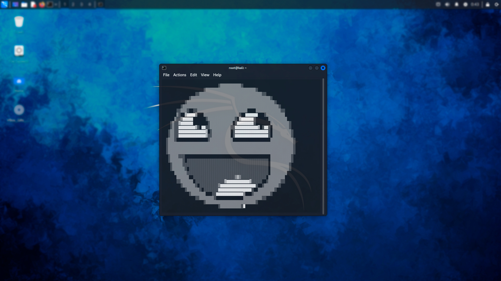

<h1 align="center">SYMPH</h1>
<h3 align="center">create a photo from symbols</h3>


# What is this
**symph** - this is a program written based on the **curses** and **opencv** libraries of the Python language or generating their symbolic version from ready-made photographs.

</div alight="center">
    
</div>

# How to use
First you need to clone the repository on your system.
```
git clone https://github.com/Sunked/symph.git
```
if you are using Linux and have **Python3**, You can make the program easier to use using by this method: <br>
move the **"symph"** file from the catalog **"scripts"** to the directory **/usr/sbin/**. and the folder with the repository itself into the directory **/usr/lib/python3/dist-packages/** (root rights may be required). <br>

After that you will be able to use the program by simply entering its name into the console, without having to go to the program directory. <br>

Otherwise you can just go to the repository directory and run:
```
python symph.py
```
after such a command you need to specify the path to the photo located on your system. <br>
To configure, you can use the options, which can be found below, or by using the **-h** or **--help** command.

### Warning
For the program to work, you should install the necessary libraries:
```
pip install opencv-python
pip install pyyaml
```
#### Only for windows:
```
pip install windows-curses
```

# How does it work
The program is not entirely stable. <br>
When generating inscriptions, there can be big problems, 
an example of this is the inscription for this documentation, in which some adjustment was used.<br>
The program on Windows works almost the same, but recognizes photo a little worse.<br>
<br>
**Use smaller photos.** 
It is advisable to use photographs no larger than **800x800.** <br>
When using large volumes of photos, the following may occur:<br> 
an exception about incorrect size, <br>
severe distortion of the photo, <br>
non-recognition of the photo and many other problems.<br>
You can use some services to reduce the size of photos. I can recommend IloveIMG. <br>
<br>
A program that works with PNG images does not recognize black colors and shades of gray (68, 68, 64) RGB.<br>
I advise you not to use black images for PNG work.<br>
<br>
If your photo is not recognized, 
please check the size of your photo and the shades, 
you can also adjust the cut of the photo, try your best.

# Options
## path of photo (positional)
As stated earlier, the first argument should be the **path to your photo** on the system. This argument is positional and required so that the program knows which photo to use.
```
symph PATH(.png, .jpg, .jpeg)
```
## Size (-s, --size)
The program automatically adjusts your photo to the size of the terminal, but if something is unsatisfactory for you, you can adjust the size by cropping it through this option, using the x and y **numbers.**
```
symph PATH -s X Y
```
## Mode (-m, --mode)
There are 3 modes in total: 
1. default (0)
2. png_squares (1)
3. art_squares (2)

default is the **default.** <br>
more details about the modes will be below.

```
symph PATH -m default OR 0
symph PATH -m png_squares OR 1
symph PATH -m art_squares OR 2
```
## Symbols (-sb, --symbol)
This option only works with **default** mode. <br>
you can select the symbols that will make up the result of the program.<br>
the default is ASCII symbols.
```
symph PATH -m 0 -sb A
```
## Config (--config)
Use to set the default program. More details will be provided below.
```
symph --config OPT ARG
```

## standard code examples
```
symph /home/user/photo.jpg -m 2 -s 50 0
symph /home/user/photo.png -m 1 -s 50 0
python symph.py /home/user/photo.png -s 50 0 -sb +
```
# Modes
## default
A completely standard mode that outputs the result as ASCII symbols (default) or as selected symbols via the **-sb** option. <br>
The mode accepts only **PNG images** and does not see black shades with shades (68, 68, 64) RGB.

## png_squares
Outputs the result from PNG images in the form of squares, each of which is inserted at a certain level of gray tint. <br>
does not react to **black** shades.
</div alight="center">
    
</div>

## art_squares
Just like **png_squares** creates squares, but at the same time reacts to **all** shades. <br>

# Configuration
In the **"data"** directory there is a file **"config.yaml"**, which contains settings for the program that are applied by default. <br>
You can completely customize this file to use some default data. <br>
Among the settings there are all the previous options, that is: **photo path, size, mode and symbol**.

## Warning
Do not change the **basic data** in the configuration file, otherwise the program will stop working correctly.

## "--config" option
You can customize the configuration file via the **"--config"** option in the terminal itself. <br>
**When changing the configuration file through the terminal, its basic appearance may change greatly!** <br>
Use the option name first, then give it an argument without extra spaces. <br>
Unfortunately, you can only set settings through the terminal **one at a time**, otherwise there will be an **error**. <br>
<br>
Usage example:
```
symph --config mode png_squares
symph --config path /home/user/Documents/photo.jpg
symph --config size 10 5
```
<br>
<h1 align="center">Thank you for your attention!</h1>
<h3 align="center">Good use.</h3>